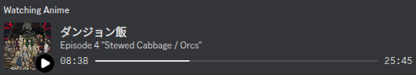
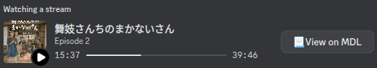

<h1 align="center">
  Anime RPC
  <a href="LICENSE"></a>
  <a></a>
</h1>

<p align="center">
  A Rich Presence integration for Discord to show what (anime) you are watching.
</p>

<p align="center">
  
  
</p>

--- 

## Installation
1. Clone the repository:
```sh
git clone https://github.com/norinorin/anime_rpc.git
cd anime_rpc
```

2. Install the dependencies:
```sh
pip install -r requirements.txt
```

3. Run the app:
```sh
python -OOm anime_rpc
```

## Configuration
anime_rpc looks for a configuration file called `rpc.config` in the anime folder you're watching. If none is found, it ignores the folder. Refer to [the example config](example.rpc.config) to get started.

## Supported platforms
| poller name      | type       | description                                       |
|------------------|------------|---------------------------------------------------|
| mpv              | poller     | polls mpv via native ipc socket or [simple-mpv-webui](https://github.com/open-dynaMIX/simple-mpv-webui). |
| mpc              | poller     | polls MPC via its web api. |
| bilibili.tv      | websocket  | support for [Bstation](https://www.bilibili.tv/anime). |

And more coming!

## Plans
- [ ] Automatically generate a regex given filenames in a folder.
- [ ] Add formatting templates for `rpc.config.match` (`{{ep}}`, `{{ep_title}}`).
- [ ] Rework browser extension.
- [ ] Add more support for anime sites and media players.
- [ ] Implement a customisable formatting.

## License
MIT
